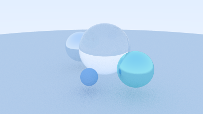
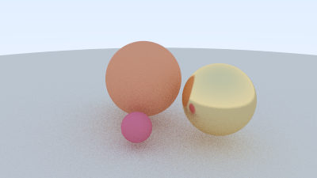

# AuraRay

AuraRay is an open-source Unity package for visualizing and experimenting with gaze-aware rendering techniques in XR. It combines a custom C++ ray tracer for generating reference renders with an interactive Unity simulator that lets developers explore how gaze position affects image quality, sampling density, and rendering cost. Designed with a reusable package architecture, AuraRay serves as both a learning tool and a foundation for future OpenXR and native plugin integration.


## Quick Demo

The Unity sample turns gaze-aware quality allocation into an interactive simulator with a moving target, live statistics, and four visualization modes.


The offline C++ renderer compares full, low, and gaze-aware sampling on the same scene using deterministic output.


## What Is Included

- A dependency-free C++17 sphere ray tracer with camera rays and anti-aliasing.
- Lambertian, metal, and dielectric materials with deterministic scene presets.
- PPM reference output, PNG portfolio export, and JSON render metadata.
- Full-quality, low-quality, gaze-aware, and overlay render modes.
- A reusable Unity package with configurable gaze, foveation regions, modes, and statistics.
- An importable Unity sample using only built-in primitives and UGUI.
- Makefile and CMake build workflows.

## Architecture

```text
C++ offline renderer
        |
        v
PPM / PNG / JSON outputs
        |
        v
Unity package: com.auraray.foveation
        |
        v
Interactive foveation simulator
```

The C++ renderer remains an offline reference implementation. Unity consumes the concepts and reference artifacts but does not call native C++ code. See [docs/architecture.md](docs/architecture.md) for component responsibilities.

## C++ Quick Start

### Makefile

Requirements: a C++17 compiler and Make.

```bash
make run
```

On macOS, export all tracked portfolio PNGs with:

```bash
make png
```

PNG conversion uses the built-in macOS `sips` tool. The renderer itself always writes portable PPM output and does not depend on `sips`.

### CMake

Requirements: CMake 3.20 or newer and a C++17 compiler.

```bash
cmake -S . -B build/cmake -DCMAKE_BUILD_TYPE=Release
cmake --build build/cmake
./build/cmake/auraray
```

Equivalent convenience targets are available through `make cmake-configure`, `make cmake-build`, and `make cmake-run`. Run the executable from the repository root so it writes to `renders/`.

## Unity Package Quick Start

The embedded package is located at `unity/AuraRayViewer/Packages/com.auraray.foveation`.

1. Open `unity/AuraRayViewer` in Unity 6000.3.17f1 or newer.
2. Open **Window > Package Management > Package Manager**.
3. Select **AuraRay Foveation Toolkit**.
4. Import **Interactive Foveation Demo**.
5. Open the imported `AuraRayViewer.unity` scene and enter Play Mode.

To install it in another local Unity project, choose **Add package from disk** and select `unity/AuraRayViewer/Packages/com.auraray.foveation/package.json`.

### Controls

- Move gaze: `WASD` or arrow keys
- Place gaze: left mouse click
- Change mode: `1` through `4`, or the on-screen buttons

The package was clean-installed into a fresh Unity 6000.3.17f1 project. Its UGUI dependency and assemblies resolved, and the sample imported and opened with zero missing scripts.

## Scene Gallery

These sphere-only scenes keep the implementation focused while giving AuraRay a visual identity beyond the tutorial baseline.

| Minimal ray tracer | XR lens demo | Glass orbs | Warm studio |
| --- | --- | --- | --- |
|  |  |  |  |

## Tested Platform

- macOS on Apple silicon
- Apple Clang 17 with C++17
- CMake 4.3.4 using a project minimum of 3.20
- Unity 6000.3.17f1
- Unity package clean-install test in a fresh project

The CMake target includes MSVC-compatible warning flags, but Windows and Linux builds have not yet been verified for `v0.1.0`.

## Current Limitations

- Foveation is simulated; it does not reduce Unity rendering workload.
- Gaze is controlled by keyboard or mouse, not real eye-tracking hardware.
- The C++ renderer is offline and is not connected to Unity through a native plugin.
- Geometry is intentionally limited to spheres, and there is no BVH or texture system.
- `make png` uses macOS `sips`; other platforms can view PPM files or use their preferred image converter.

## Roadmap

### v0.1.0 release

- Create and publish the `v0.1.0` GitHub tag and release.

### Future updates

- Add focused Unity EditMode tests and lightweight CI.
- Add Android/XR device build documentation.
- Test the Unity sample on XR hardware.
- Consider a replaceable gaze-provider interface when a second input source exists.
- Explore OpenXR eye-gaze input.
- Evaluate native C++ integration only after the offline and Unity APIs are stable.

## Documentation

- [Architecture](docs/architecture.md)
- [Development log](docs/devlog.md)
- [Unity package README](unity/AuraRayViewer/Packages/com.auraray.foveation/README.md)
- [Changelog](CHANGELOG.md)

## License

AuraRay is available under the [MIT License](LICENSE).
