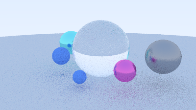
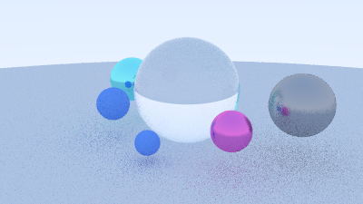
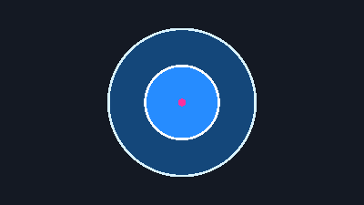
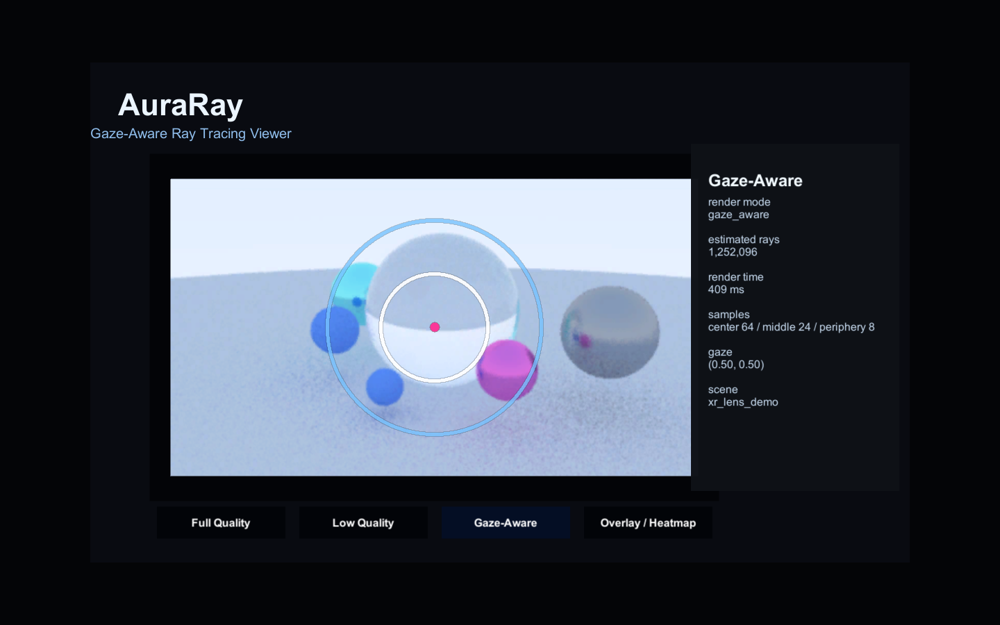
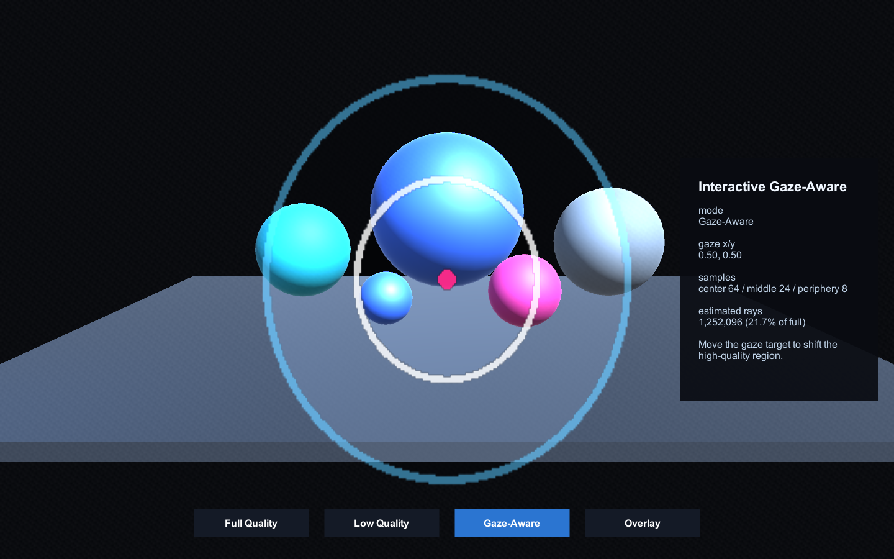

# AuraRay
A minimal C++ ray tracer exploring gaze-aware rendering for XR.

## Build

```bash
make run
```

## Export portfolio-friendly images

```bash
make png
```

Current outputs:
- `renders/first_image.ppm` / `renders/first_image.png`
- `renders/first_sphere.ppm` / `renders/first_sphere.png`
- `renders/antialias_sphere.ppm` / `renders/antialias_sphere.png`
- `renders/minimal_raytracer.ppm` / `renders/minimal_raytracer.png`
- `renders/glass_orbs.ppm` / `renders/glass_orbs.png`
- `renders/xr_lens_demo.ppm` / `renders/xr_lens_demo.png`
- `renders/warm_studio_spheres.ppm` / `renders/warm_studio_spheres.png`
- `renders/foveated_full.ppm` / `renders/foveated_full.png`
- `renders/foveated_low.ppm` / `renders/foveated_low.png`
- `renders/foveated_gaze.ppm` / `renders/foveated_gaze.png`
- `renders/foveated_overlay.ppm` / `renders/foveated_overlay.png`

## Milestone 1: Minimal Ray Tracer

AuraRay now renders a small Ray Tracing in One Weekend-style scene with camera rays, anti-aliasing, diffuse materials, metal materials, and multiple spheres over a ground sphere.


## Scene Presets

These are intentionally composed sphere-only scenes that make AuraRay visually distinct from the tutorial baseline while keeping the renderer small.

| glass_orbs | xr_lens_demo | warm_studio_spheres |
| --- | --- | --- |
|  |  |  |

## Milestone 3: Simulated Foveated Rendering

Full quality uses many rays everywhere. Low quality uses fewer rays everywhere. Gaze-aware rendering spends more rays near a simulated gaze point and fewer rays in the periphery, inspired by XR systems where the user mostly notices detail near where they are looking.

| full quality | low quality | gaze-aware | gaze overlay |
| --- | --- | --- | --- |
|  |  |  |  |

## Milestone 4: Unity Aura Viewer

The C++ renderer generates PNG images and JSON metadata. The Unity viewer loads those exported files and presents them in an XR-inspired floating display so the full, low, gaze-aware, and overlay modes can be compared interactively.

Open the Unity project at `unity/AuraRayViewer`, then open the `AuraRayViewer` scene. Use the buttons or keys `1`-`4` to switch modes.



## Interactive Unity Foveation Simulator

The C++ renderer remains the offline/reference renderer. The Unity scene now simulates how an XR system could move the high-quality region based on gaze, using a movable `EyeTarget` instead of real eye tracking. This prepares AuraRay for future real eye-tracking or native-plugin integration without coupling Unity to the C++ renderer yet.

Open `unity/AuraRayViewer`, run the `AuraRayViewer` scene, and move the gaze target with `WASD` or arrow keys. Use `1`-`4` or the on-screen buttons to switch between Full Quality, Low Quality, Gaze-Aware, and Overlay modes.



## Phase 4: Unity Package

AuraRay now includes a reusable Unity package at `unity/AuraRayViewer/Packages/com.auraray.foveation`. The package provides components for gaze target movement, foveation overlay rendering, quality mode switching, and stats visualization.

The current interactive simulator is preserved as the **Interactive Foveation Demo** sample. Import it from Unity Package Manager to inspect or run the complete setup. The C++ ray tracer remains separate as AuraRay's offline/reference renderer; this package does not introduce a native plugin or real-time C++ rendering.

## Gallery

| Milestone | Output |
| --- | --- |
| First image pipeline | `renders/first_image.png` |
| First camera-ray sphere | `renders/first_sphere.png` |
| Anti-aliased sphere | `renders/antialias_sphere.png` |
| Minimal ray tracer scene | `renders/minimal_raytracer.png` |
| Pretty scene preset: glass_orbs | `renders/glass_orbs.png` |
| Pretty scene preset: xr_lens_demo | `renders/xr_lens_demo.png` |
| Pretty scene preset: warm_studio_spheres | `renders/warm_studio_spheres.png` |
| Foveated full quality | `renders/foveated_full.png` |
| Foveated low quality | `renders/foveated_low.png` |
| Foveated gaze-aware | `renders/foveated_gaze.png` |
| Foveated overlay | `renders/foveated_overlay.png` |
| Unity Aura Viewer | `docs/screenshots/unity_aura_viewer.png` |
| Interactive Unity Foveation Simulator | `docs/screenshots/unity_interactive_foveation.png` |
