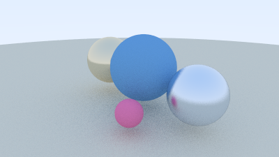

# AuraRay
A minimal C++ ray tracer exploring gaze-aware rendering for XR.

## Build

```bash
make run
```

## Export portfolio-friendly images

```bash
make png
```

Current outputs:
- `renders/first_image.ppm` / `renders/first_image.png`
- `renders/first_sphere.ppm` / `renders/first_sphere.png`
- `renders/antialias_sphere.ppm` / `renders/antialias_sphere.png`
- `renders/minimal_raytracer.ppm` / `renders/minimal_raytracer.png`

## Milestone 1: Minimal Ray Tracer

AuraRay now renders a small Ray Tracing in One Weekend-style scene with camera rays, anti-aliasing, diffuse materials, metal materials, and multiple spheres over a ground sphere.



## Gallery

| Milestone | Output |
| --- | --- |
| First image pipeline | `renders/first_image.png` |
| First camera-ray sphere | `renders/first_sphere.png` |
| Anti-aliased sphere | `renders/antialias_sphere.png` |
| Minimal ray tracer scene | `renders/minimal_raytracer.png` |
