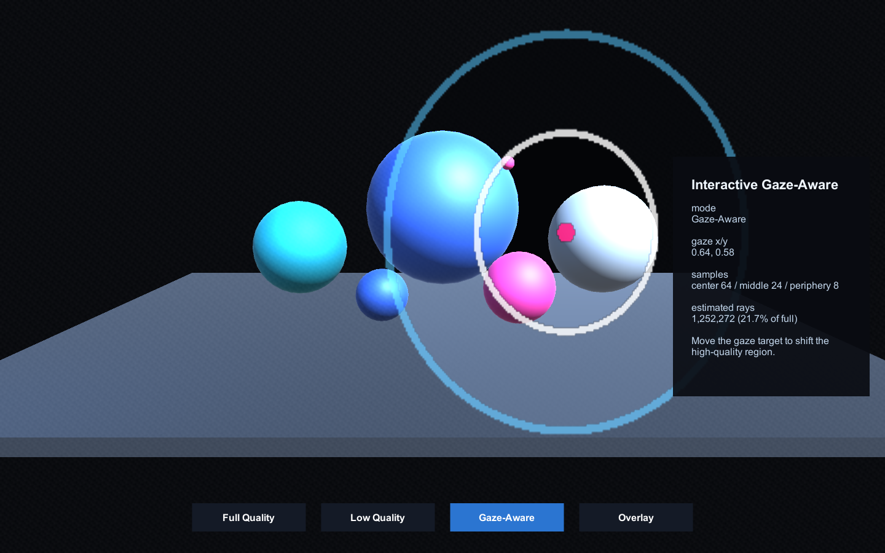
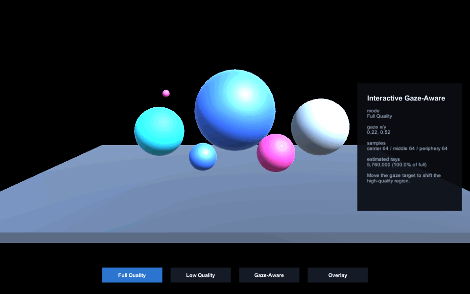
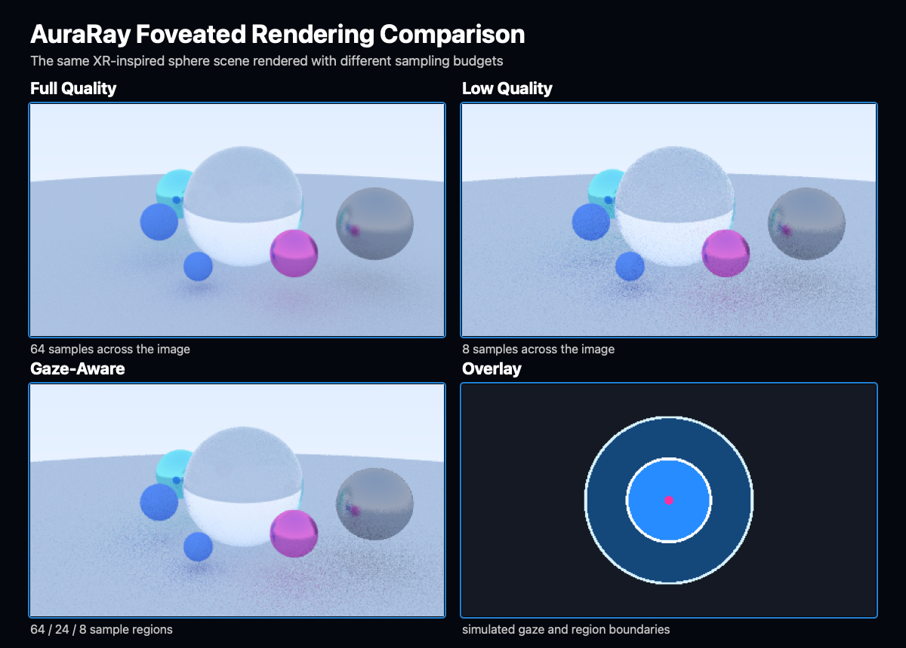

# AuraRay

<<<<<<< Updated upstream
AuraRay is an open-source Unity package for visualizing and experimenting with gaze-aware rendering techniques in XR. It combines a custom C++ ray tracer for generating reference renders with an interactive Unity simulator that lets developers explore how gaze position affects image quality, sampling density, and rendering cost. Designed with a reusable package architecture, AuraRay serves as both a learning tool and a foundation for future OpenXR and native plugin integration.
=======
AuraRay is an open-source Unity package and C++ renderer for experimenting with gaze-aware rendering techniques in XR.

The repository contains two deliberately separate systems: a deterministic C++17 ray tracer for generating reference images and sampling metadata, and a Unity package for interactively visualizing foveation regions around a simulated gaze point. The current integration is artifact- and concept-based; Unity does not load or execute the C++ renderer.
>>>>>>> Stashed changes



## What It Does

- Renders sphere scenes with camera rays, anti-aliasing, recursive scattering, and Lambertian, metal, and dielectric materials.
- Produces deterministic full-quality, low-quality, gaze-aware, and foveation-overlay outputs.
- Writes dependency-free PPM images and JSON metadata; macOS tooling exports PNG copies.
- Provides a reusable Unity package for simulated gaze input, quality-region overlays, mode control, and runtime statistics.
- Includes an importable Unity sample and reproducible demo-media tooling.





## Architecture

```text
C++ renderer -> PPM / PNG / JSON reference artifacts
                                  |
                                  v
Unity package -> interactive foveation simulator
```

The C++ source is organized by responsibility:

| Module | Responsibility |
| --- | --- |
| `src/core` | Vector math, rays, camera, and deterministic random sampling |
| `src/geometry` | Hittable contract, sphere intersections, and nearest-hit traversal |
| `src/materials` | Material interface and Lambertian, metal, and dielectric scattering |
| `src/render` | Scene definitions, render loops, recursive ray tracing, and foveation policy |
| `src/io` | PPM encoding and JSON metadata output |
| `src/main.cpp` | CLI parsing and renderer invocation only |
| `unity/AuraRayViewer/Packages/com.auraray.foveation` | Reusable Unity runtime/editor package and sample |

CMake exposes the renderer implementation as the `auraray_renderer` static library and links it into the `auraray` CLI. See [docs/architecture.md](docs/architecture.md) for more detail.

## Build The C++ Renderer

Requirements:

- CMake 3.20 or newer
- A C++17 compiler

From a clean clone:

```bash
cmake -S . -B build/cmake -DCMAKE_BUILD_TYPE=Release
cmake --build build/cmake --config Release
```

Run all reference renders:

```bash
./build/cmake/auraray --output-dir renders
```

Show CLI options:

```bash
./build/cmake/auraray --help
```

The Makefile remains available as a convenience path:

```bash
make run
make cmake-run
```

## Reproducibility Check

Every stochastic render uses a fixed seed. The repository stores expected SHA-256 hashes for all 11 PPM outputs.

Run the check through CTest:

```bash
ctest --test-dir build/cmake --output-on-failure
```

Or use the Makefile target:

```bash
make verify
```

The validation renders into a temporary directory, compares every PPM against `tests/expected_render_hashes.sha256`, and leaves tracked outputs unchanged.

## Image And Metadata Outputs

The renderer writes into the selected `--output-dir`:

- `.ppm`: canonical deterministic image output
- `.json`: scene, camera, sampling, timing, and estimated-ray metadata
- `.png`: generated separately for documentation and preview use

On macOS, regenerate the tracked PNG exports with:

```bash
make png
```

PNG conversion uses the built-in `sips` command. It is not a renderer dependency.

## Unity Package

The embedded package is located at:

```text
unity/AuraRayViewer/Packages/com.auraray.foveation
```

To run the sample in the included project:

1. Open `unity/AuraRayViewer` with Unity 6000.3.17f1 or newer.
2. Open **Window > Package Management > Package Manager**.
3. Select **AuraRay Foveation Toolkit**.
4. Import **Interactive Foveation Demo**.
5. Open the imported `AuraRayViewer.unity` scene and enter Play Mode.

Controls:

- Move simulated gaze: `WASD` or arrow keys
- Place gaze: left mouse click
- Change mode: `1` through `4`, or the on-screen buttons

To install the package in another local Unity project, choose **Add package from disk** and select its `package.json`. Version `0.1.0` was verified through a fresh Unity project import with zero missing scripts.

## Tested Configuration

- macOS on Apple silicon
- Apple Clang 17 with C++17
- CMake 4.3.4, with project minimum 3.20
- Unity 6000.3.17f1

The CMake configuration includes MSVC warning flags, but Windows and Linux builds have not yet been verified.

## Current Limitations

- Unity foveation is a visualization; it does not implement variable-rate shading or reduce GPU workload.
- Gaze is simulated through keyboard and mouse input rather than eye-tracking hardware.
- The C++ renderer is offline and has no native Unity plugin boundary.
- Geometry is limited to spheres; there is no BVH, texture system, or production scene importer.
- Render metadata JSON is written directly and assumes built-in scene strings.
- The reproducibility check currently runs on POSIX systems with `shasum` or `sha256sum`.

## Future Work

<<<<<<< Updated upstream
### v0.1.0 release

- Create and publish the `v0.1.0` GitHub tag and release.

### Future updates

- Add focused Unity EditMode tests and lightweight CI.
- Add Android/XR device build documentation.
- Test the Unity sample on XR hardware.
- Consider a replaceable gaze-provider interface when a second input source exists.
- Explore OpenXR eye-gaze input.
- Evaluate native C++ integration only after the offline and Unity APIs are stable.
=======
- Add lightweight CI across macOS and Linux.
- Add focused unit tests for geometry, material scattering, and foveation sample selection.
- Introduce a replaceable Unity gaze-provider interface when a second input source exists.
- Explore optional OpenXR eye-gaze input.
- Evaluate Project Aura and physical-device deployment as future platform research; neither is currently supported or claimed.
- Consider native C++/Unity integration only after the offline renderer API and Unity package API are stable.
>>>>>>> Stashed changes

## Documentation

- [Architecture](docs/architecture.md)
- [Unity package README](unity/AuraRayViewer/Packages/com.auraray.foveation/README.md)
- [Development log](docs/devlog.md)
- [Changelog](CHANGELOG.md)
- [Demo media generation](docs/media/README.md)

## License

AuraRay is available under the [MIT License](LICENSE).
